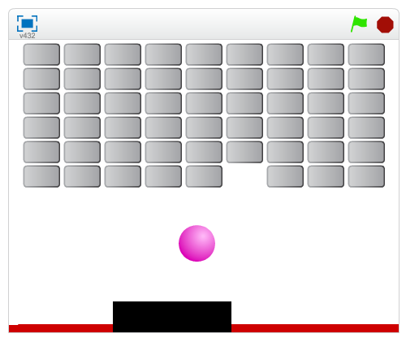

# Introduktionsuppgift
Hej och välkommen till dagens CoderDojo.

Idag ska vi lära oss att skapa ett spel, Breakout. Spelet går ut på att en boll studsar på en platta som spelaren styr. När bollen träffar brickorna ovanför så ska dessa försvinna.

Innan vi börjar så ska du få rita de delar spelet använder på ett papper.

Rita därför:
* En boll
* En bricka
* Plattan som bollen ska studsa på

Vi kan sedan läsa in dessa med webbkameran och använda i vårt spel!
