# Breakout
I denna utmaning ska du få bygga ett spel! Spelet heter Breakout och är en riktig tv-spelsklassiker. Du kan se hur spelet kan komma att se ut när du är klar: [Testa Breakout](http://scratch.mit.edu/projects/45924598/)

Testa spelet och fundera lite över vilka delar som finns:
* Vad ska spelaren kunna kontrollera?
* Vad ska finnas från början, innan spelet startar?

_Fuska? Du kan titta på [färdiga lösningen](#user-content-färdiga-lösningen) direkt._

## Plattan
Vi börjar med att skapa plattan som bollen ska studsa på.

### Skapa och placera ut plattan
Ta bort katten! Den får inte vara med i detta projekt.

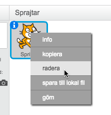

Skapa en ny sprite

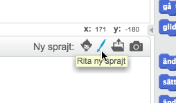

Rita nu en fyrkant och fyll den med en färg.

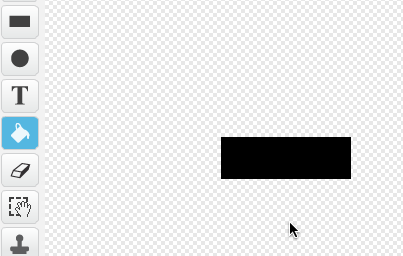

Du kan nu namnge plattan så att den inte heter "Sprite2". Högerklicka och välj "Info". Där kan du sedan ändra namn.

Nu ligger plattan i mitten men vi vill ha den längst ner i mitten när spelet börjar. Gå därför in till "Skript" på plattan och tala om var den ska ligga när spelet börjar:

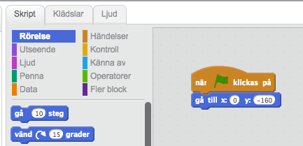

Testa genom att klicka på den gröna flaggan

### Få plattan att röra sig
Vi vil nu att plattan rör sig när du rör musen. Vi gör det genom

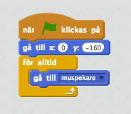

Men vad nu då? Den stannar ju inte kvar där nere? Vi måste tala om att den inte får lämna sitt y-värde.

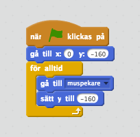

Testa!

## Bollen
Nu ska vi skapa en boll och placera ut den.

### Skapa bollen
Många vanliga saker finns det redan andra som har gjort så nu ska vi låna en färdig boll.

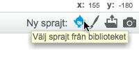

Eftersom vi letar efter en boll så väljer vi "Sport"

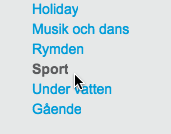

Välj en boll som du tycker passar

### Placera ut bollen och få den att studsa
På samma sätt som med plattan så behöver bollen ha en fast startposition.

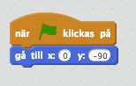

Nu vill vi att bollen börjar röra sig. 

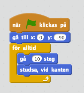

Testa hela tiden!

Bollen studsar fram och tillbaka på en rak linje. Vi kan få den att studsa lite roligare genom att tala om att den från början ska ge sig av lite snett. 

Nu händer det ingenting när bollen rör vår platta. Detta måste vi fixa. Vi talar om att bollen ska studsa när den träffar plattan. Detta block är lite knepigt och består av många olika delar:

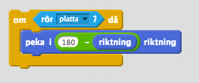

*Om* bollen rör *plattan* då ska vi peka om bollen i en annan riktning. Riktningen måste vi räkna ut för att det ska fungera oavsett om bollen kommer från höger eller vänster.

Dra sedan in blocket i din *för alltid*-loop. 

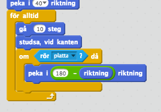

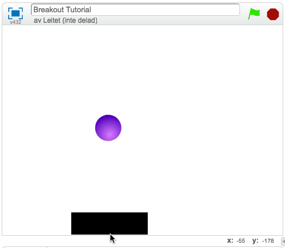

### Få bollen att brinna upp
Om vi missar bollen nu så gör det inte så mycket eftersom den bara studsar mot botten. Istället vill vi att bollen brinner upp och spelet tar slut när detta händer!

Börja med att rita lite lava i din bakgrund:

Det är viktigt att lavan inte sticker upp ovanför vår platta!

Nu behöver tala om för bollen att den ska göra någon när den träffar lavan. Eftersom vi har målat lavan med en och samma färg så kan vi använda kontrollblocket *om bollen rör färgen*

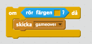

För att välja färg klickar du i färgrutan och klickar sedan på lavan.

När bollen rör lavan ska vi utnyttja något som heter "Meddelanden" för tala om för andra delar i spelet att "nu är spelet slut". Vi lägger därför till händelsen *skicka* och skriver ett eget meddelande: "gameover"

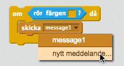

Vi lägger sedan till *om*-blocket i vår loop. Vi lägger också till kontrollblocket *stoppa skript* så att bollen inte fortsätter studsa när vi förlorat.

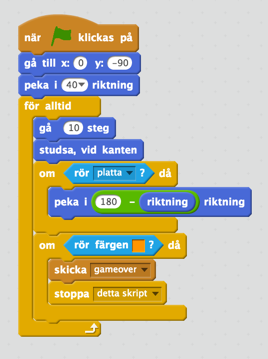

Skapa nu en ny "klädsel" till bollen och rita hur du vill att den ska se ut när spelet är slut.

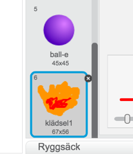

Nu ska vi se till att byta klädsel på bollen. Vi skulle kunna göra detta innuti blocket när vi rör lavan, men för att undvika att vårt block blir jättestort och svårt att läsa så delar vi upp detta i en separat del. Kom du ihåg att vi skickar meddelandet "gameover"? Vi kan nu lyssna efter detta meddelande och byta klädsel när det inträffar.

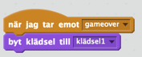

Nu märker vi att vi har några *buggar* i kod. När bollen träffar lavan så lutar den så vår eld hamnar snett. När vi startar om spelet så har bollen fortfarande på sig den brinnande klädseln. Vi får buggfixa fixa genom att:

* Se till att bollen inte roterar när den studsar.
* Se till att rätt klädsel väljs när vi startar spelet.

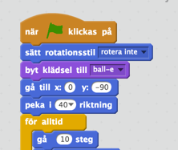

Bra jobbat! Nu har vi kommit ganska långt!

## Skapa block
Vi börjar med att skapa ett block. Jag har valt den färdiga "Button2" som du hittar i sprajt-bibloteket.

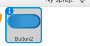

Vi börjar med att lägga ut det första blocket längst upp till vänster:

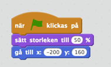

Vi skapar nu en klon av denna och flyttar sedan vårt block en bit till höger. 

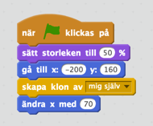

Vi skulle nu kunna upprepa detta flera gånger för att skapa fler block, men gör inte det!

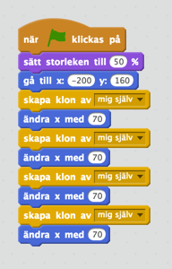

Om vi har många block så blir det väldigt mycket kod och det är dessutom jobbigt att ändra något eftersom vi får ändra på många ställen. Istället använder vi kontrollblock som repeterar flerar gånger. 7 block fick jag plats med på en rad.

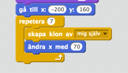

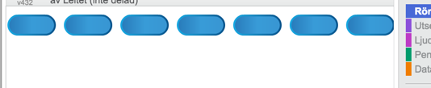

Nu vill vi göra en ny rad så vi flyttar tillbaka _x_ till _-200_ och minskar _y_ med _35_. Sedan gör vi detta en gång för varje rad som vi vill ha. Men vi märker nu att vi får samma problem som innan. Samma kod flera gånger eftervarandra vilket blir väldigt mycket!

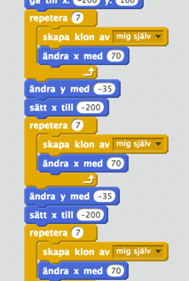

Vi väljer därför att skapa en ny repeterare som repeterar vår kod för varje rad. Fyra rader var lagom för mig.

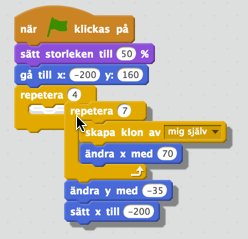

Som du kanske ser så har vi en liten bugg. Knappen som vi skapar kloner av syns den också. Vi fixar det på samma sätt som i vulkanen genom att först gömma brickan och sedan för varje klon, visa igen

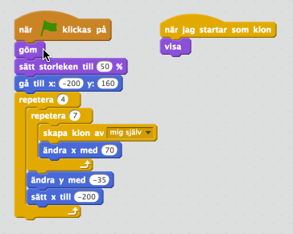

## Få bollen att studsa mot brickorna och förstöra dem
Kan du själv klura ut hur du ska göra för att få bollen att:
1. Studsa mot blocken
2. Få brickorna att försvinna när bollen studsat mot dem?

Testa själv, du hittar sedan en lösning nedan.

### Studsa mot brickorna
Gå in till skriptet för bollen och titta på hur vi fick den att studsa mot plattan. Kan vi göra på motsvarande sätt för brickorna?

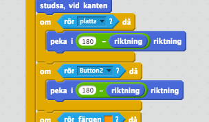

### Få brickorna att försvinna
I skriptet för brickorna:

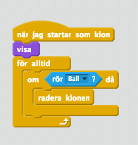

## Buggfix
Även om vi har en fullt spelbar version nu så finns det några saker att jobba vidare på. Vi ser att det tar ett tag att rita upp alla brickor och kanske ska inte bollen starta förrän vi är klara med det. 

Fundera om det finns ett sätt att tala om för bollen att börja röra sig när alla brickor är utritade? 

Tips: Kan vi kanske skicka ett meddelande från brickorna till bollen på något sätt?

## Färdiga lösningen

Här nedanför ser du nu den färdiga lösningen:

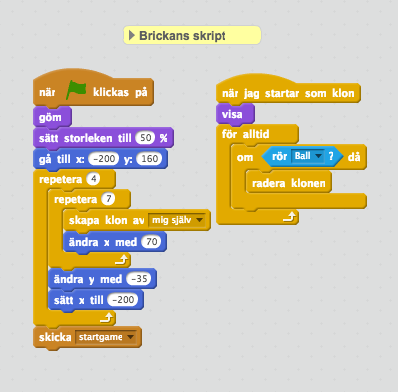

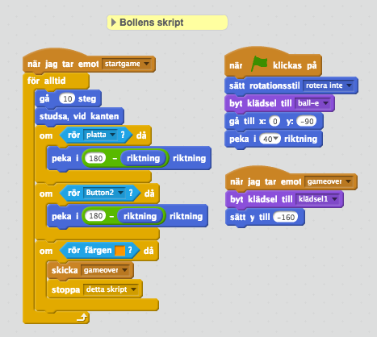

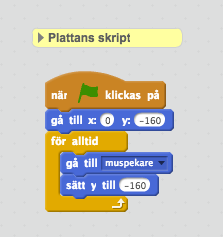

## Fortsätta arbeta med spelet
Du har nu gjort ett kul grundspel, men det finns så mycket mer roliga saker vi kan bygga ut vårt spel med:

Några förslag:
* När brickor träffas så skulle vi kunna se till att det ibland trillar ner lite bonusar i form av elaka saker som gör att vår platta blir mindre, eller bra saker som gör den större.
* Kanske skulle vi ha lite meddelanden till vår spelara där det står "Game Over" när spelet är slut?
* På något sätt ta reda på när alla brickor är borta och då skriva att man vann?
* Kanske skulle man kunna göra en ny bana när denna är färdig?
* Vi borde kanske ha tre liv och inte bara ett?
* Bollen studsar lite tråkigt just nu. Kan vi lägga till en viss slumpfaktor så att bollen inte studsar "perfekt" varje gång?
* Lägg tillljudeffekter när bollen studsar på plattan, träffar en bricka och brinner upp i lavan. 

För inspiration kan du söka på "Breakout" på scratch eller titta på [vår version](http://scratch.mit.edu/projects/45924598/).

