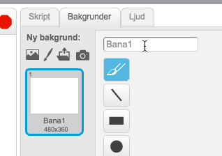
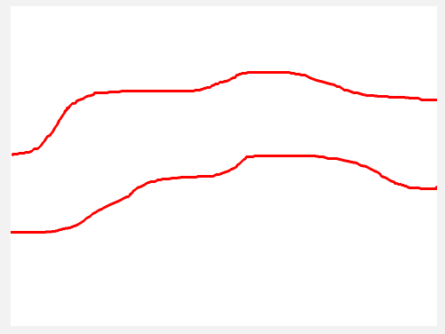
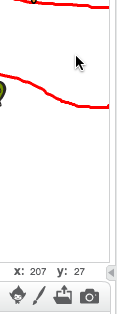
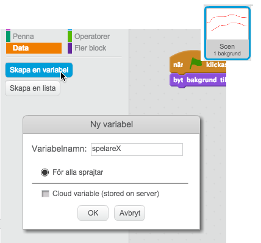
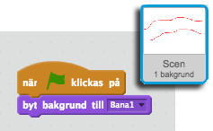
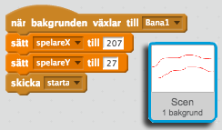
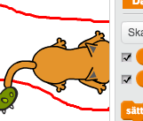
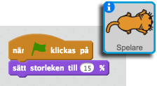

# Drakborgen
I denna utmaning ska vi göra ett häftigt spel! Dragborgen där du som spelare ska guida en katt genom drakens borg. Men akta dig så att inte draken tar dig!

## Spelplanen
Vi börjar med att skapa en bakgrund som vi döper till "Bana1"

Nu ska vi rita vår bana. Det är viktigt att vi använder den RÖDA pennan för att rita banans gränser. Gör inte första banan för svår.

## Sprajtsen
Nu ska vi skapa skapa våra sprajts.

Viktigt! Döp dem till:
* Spelare
* Drake
* Mål

## Startvillkor
Vi måste se till att alla objekt startar på rätt ställe. Vi börjar med att placera ut spelaren. 

Sätt muspekaren där du vill ha spelaren och se vilken x/y-koordinat som är där.

Gå till bakgrundens Skriptflik och tala om att när spelet startar så ska vi byta bakgrund till "Bana1". (Detta blir viktigt senare)

Nu skapar vi två variabler, spelareX och spelareY, som talar om var spelaren (katten) ska börja på denna bana.

Nu talar vi om att när bakgrunden växlar till "Bana1" så ska spelarens X och Y position sättas till de värden som jag tycker är lämpligt. I mitt fall 207/27.

Vi behöver nu tala om för omvärlden att vårt spel ska starta när vi placerat ut vår katt.

Nu kan vi gå in på vår spelare och tala om att den ska börja på dessa värden.

Testa nu så att din spelare är på rätt ställe! Annars får du justera X- och Y-värdena på bakgrunden.

Men vad stor den var. Vi minskar den:

Nu vill vi få katten (musen?) att följa efter vår muspekare.

Vi vill dock inte att spelaren ska följa efter muspekaren dirket när vi startar spelet så vi lägger till att man måste klicka på katten.

