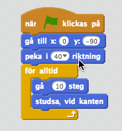

# Breakout
I denna utmaning....

## Plattan
Vi börjar med att skapa plattan som bollen ska studsa på.

### Skapa och placera ut plattan
Ta bort katten! Den får inte vara med i detta projekt.

Skapa en ny sprite

Rita nu en fyrkant och fyll den med en färg.

Nu ligger palattan i mitten men vi vill ha den längst ner i mitten när spelet börjar. Gå därför in till "Skrip" på plattan och tala om var den ska ligga när spelet börjar:

Testa genom att klicka på den gröna flaggan

### Få plattan att röra sig
Vi vil nu att plattan rör sig när du rör musen. Vi gör det genom

Men vad nu då? Den stannar ju inte kvar där nere? Vi måste tala om att den inte får lämna sitt y-värde.

Testa!

## Bollen
Nu ska vi skapa en boll och placera ut den.

### Skapa bollen
Många vanliga saker finns det redan andra som har gjort så nu ska vi låna en färdig boll.

Eftersom vi letar efter en boll så väljer vi "Sport"

Välj en boll som du tycker passar

### Placera ut bollen och få den att studsa
På samma sätt som med plattan så behöver bollen ha en fast startposition.

Nu vill vi att bollen börjar röra sig. 

Testa hela tiden!

Bollen studsar fram och tillbaka på en rak linje. Vi kan få den att studsa lite roligare genom att tala om att den från början ska ge sig av lite snett. 

Nu händer det ingenting när bollen rör vår platta. Detta måste vi fixa. Vi talar om att bollen ska studsa när den träffar plattan. Detta block är lite knepigt och består av många olika delar:

*Om* bollen rör *plattan* då ska vi peka om bollen i en annan riktning. Riktningen måste vi räkna ut för att det ska fungera oavsett om bollen kommer från höger eller vänster.

Dra sedan in blocket i din *för alltid*-loop. 

### Få bollen att brinna upp
Om vi missar bollen nu så gör det inte så mycket eftersom den bara studsar mot botten. Istället vill vi att bollen brinner upp och spelet tar slut när detta händer!

Börja med att rita lite lava i din bakgrund:

Det är viktigt att lavan inte sticker upp ovanför vår platta!

Nu behöver tala om för bollen att den ska göra någon när den träffar lavan. Eftersom vi har målat lavan med en och samma färg så kan vi använda kontrollblocket *om bollen rör färgen*

För att välja färg klickar du i färgrutan och klickar sedan på lavan.

När bollen rör lavan ska vi utnyttja något som heter "Meddelanden" för tala om för andra delar i spelet att "nu är spelet slut". Vi lägger därför till händelsen *skicka* och skriver ett eget meddelande: "gameover"

Vi lägger sedan till *om*-blocket i vår loop. Vi lägger också till kontrollblocket *stoppa skript* så att bollen inte fortsätter studsa när vi förlorat.

Skapa nu en ny "klädsel" till bollen och rita hur du vill att den ska se ut när spelet är slut.

Nu ska vi se till att byta klädsel på bollen. Vi skulle kunna göra detta innuti blocket när vi rör lavan, men för att undvika att vårt block blir jättestort och svårt att läsa så delar vi upp detta i en separat del. Kom du ihåg att vi skickar meddelandet "gameover"? Vi kan nu lyssna efter detta meddelande och byta klädsel när det inträffar.

Nu märker vi att vi har några *buggar* i kod. När bollen träffar lavan så lutar den så vår eld hamnar snett. När vi startar om spelet så har bollen fortfarande på sig den brinnande klädseln. Vi får buggfixa fixa genom att:

* Se till att bollen inte roterar när den studsar.
* Se till att rätt klädsel väljs när vi startar spelet.

Bra jobbat! Nu har vi kommit ganska långt!

## Skapa block
Vi börjar med att skapa ett block. Jag har valt den färdiga "Button2" som du hittar i sprajt-bibloteket.

Vi börjar med att lägga ut det första blocket längst upp till vänster:

Vi skapar nu en klon av denna och flyttar sedan vårt block en bit till höger. 

Vi skulle nu kunna upprepa detta flera gånger för att skapa fler block, men gör inte det!

Om vi har många block så blir det väldigt mycket kod och det är dessutom jobbigt att ändra något eftersom vi får ändra på många ställen. Istället använder vi kontrollblock som repeterar flerar gånger. 7 block fick jag plats med på en rad.

Nu vill vi göra en ny rad så vi flyttar tillbaka _x_ till _-200_ och minskar _y_ med _35_. Sedan gör vi detta en gång för varje rad som vi vill ha. Men vi märker nu att vi får samma problem som innan. Samma kod flera gånger eftervarandra vilket blir väldigt mycket!

Vi väljer därför att skapa en ny repeterare som repeterar vår kod för varje rad. Fyra rader var lagom för mig.

