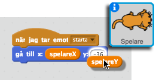
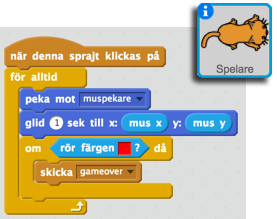
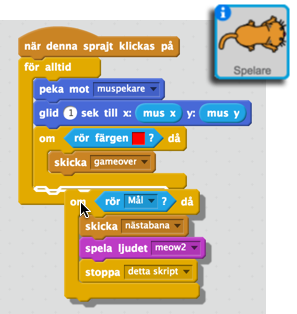

# Drakborgen
I denna utmaning ska vi göra ett häftigt spel! Dragborgen där du som spelare ska guida en katt genom drakens borg. Men akta dig så att inte draken tar dig!

Här hittar du en [version av spelet](http://scratch.mit.edu/projects/50419786/).

## Spelplanen
Vi börjar med att skapa en bakgrund som vi döper till "Bana1"

Nu ska vi rita vår bana. Det är viktigt att vi använder den RÖDA pennan för att rita banans gränser. Gör inte första banan för svår.

## Sprajtsen
Nu ska vi skapa skapa våra sprajts.

Viktigt! Döp dem till:
* Spelare
* Drake
* Mål

## Startvillkor
Vi måste se till att alla objekt startar på rätt ställe. Vi börjar med att placera ut spelaren. 

Sätt muspekaren där du vill ha spelaren och se vilken x/y-koordinat som är där.

Gå till bakgrundens Skriptflik och tala om att när spelet startar så ska vi byta bakgrund till "Bana1". (Detta blir viktigt senare)

Nu skapar vi två variabler, spelareX och spelareY, som talar om var spelaren (katten) ska börja på denna bana.

Nu talar vi om att när bakgrunden växlar till "Bana1" så ska spelarens X och Y position sättas till de värden som jag tycker är lämpligt. I mitt fall 207/27.

Vi behöver nu tala om för omvärlden att vårt spel ska starta när vi placerat ut vår katt.

Nu kan vi gå in på vår spelare och tala om att den ska börja på dessa värden.

Testa nu så att din spelare är på rätt ställe! Annars får du justera X- och Y-värdena på bakgrunden.

Men vad stor den var. Vi minskar den:

Nu vill vi få katten (musen?) att följa efter vår muspekare.

Vi vill dock inte att spelaren ska följa efter muspekaren direkt när vi startar spelet så vi lägger till att man måste klicka på katten.

Nu ska vi se till att spelet tar slut om vi rör kanten. Men först gömmer vi vår drake och vårt mål så länge:

Skicka meddelandet "gameover" om spelaren rör kanten

Vi talar på bakgrunden om att hela spelet ska stannas om det blir Game over

Och så skapar vi oss en ny sprajt som vi kan visa och tala om att spelet är slut.

### Målet
Nu sätter vi ut målet. Vi gör på samma sätt som med spelaren. Vi skapar en X- och en Y-variabel och sätter dess värden till där vi vill ha målet. 

När vår spelare kommer till målet så ska vi skicka ett meddelande om att vi ska skapa en ny bana.

Nu kan vi enkelt göra en ny bana.

Rita en ny bakgrund. Döp den till "Bana2". Gör den lite svårare och kanske åt andra hållet.

Nu måste vi se till att när man klarat en bana så ska nästa "laddas". 

Men, nu ligger ju målet och katten kvar på samma ställe som förra gången. Vi måste flytta dem när en ny bana laddas. Vi behöver *kopiera* *startvillkoren* för vår spelare och vårt mål. På bakgrunden kopierar vi därför dessa.

Sedan byter vi till "Bana2" och ändrar X- och Y-värdena till de som vi vill att vår objekt ska ha när banan startar.

## Draken
Är det för lätt? Kanske kan du lägga till en drake som flyger omkring på banan och om den rör vår spelare så blir det Game Over. Klarar du det själv?

Försök gärna själv. Annars har du lösningen nedan:

Observera att vi skapade två nya variabler, drakeX och drakeY för att tala om var draken skulle börja. Sedan har vi lite kod för att få draken att röra sig lite oregelbundet och studsa mot väggarna. Draken tål de varma väggarna!

##Utöka spelet
Nu kan du utöka spelet. Det finna massvis med grejor man kan göra

Lätt:
* Gör fler spännande banor. Kanske måste man springa igenom drakens stora rum.

Knepigt:
* Skapa en timer så att man ska försöka få så kort tid som möjligt på banorna
* Lägg till en skatt som draken vaktar som man måste hämta, eller så räknas tiden ner när man hittar skatten.
* Speciella hinder som rör sig i banan. Dörrar som öppnas och stängs?
