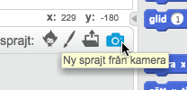
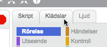
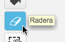
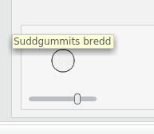
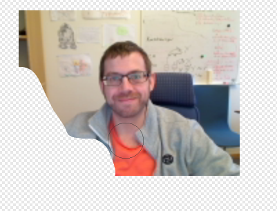
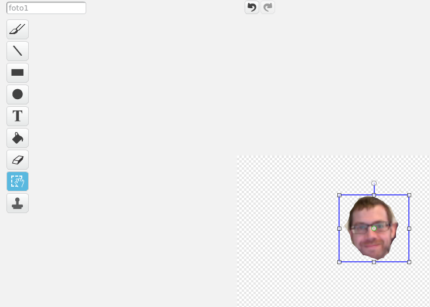
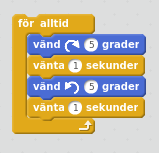
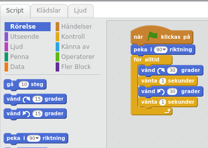

Utmaning 1 en animerad hälsning!
=========================

Nu skall vi göra en animerad hälsning som visar vem du är och vad du gillar!

Du kan titta på min här: http://scratch.mit.edu/projects/44181530/

Om du inte har gjort ett konto ännu kan du gå till [start](starta.md)

Ta en bild och byt ut katten mot ett huvud.
------------------------------
 
 
 Högerklicka på katten och välj radera.
 
 

Välj sedan den lilla kameran (Ny sprite från kameran).

Webbkameran på din dator måste vara igång, det brukar komma upp en dialogruta i övre delen av fönstret, klicka "Allow eller Tillåt". Om detta inte går fråga en mentor!

När du kan se dig i det lilla kamerafönstret, titta in i kameran och klicka spara.

Ta bort bakgrund
----------------
Du har nu fått en ny sprite, men antagligen är det mer än ditt huvud i bilden.
För att ta bort bakgrunden kring ditt huvud. 
 

 * välj Klädslar (Mellan Script och Ljud), här är en enkel bildredigerare där man kan rita. 

 * välj Radera, nu har du ett suddgummi! 
 

 
 * Gör suddgummit större genom att öka bredden, det finns en kontroll för det långt ner i fönstret.
 

 * rita bort det som finns runt ditt huvud, om du råkar ta bort för mycket kan du välja (ångra (CTRL+Z))
 * Den schackrutiga bakgrunden visar vad som är genomskinligt

Flytta ditt huvud så att det kan rotera kring halsen
------------------------------------------------------------------
Vi vill att huvudet ska kunna vicka på sig, för att det ska kunna göra det måste halsen på huvudet vara i mitten av sprite-fönstret.

 * Välj verktyget "Välj" under "radera"
 * Dra ut en låda runt ditt ansikte, allt innanför kan nu flyttas eller skalas om
 * Tryck ner musen på ditt ansikte och dra för att flytta ditt ansikte

 * Flytta ansiktet så att det är precis ovanför mitten på den schackrutiga bakgrunden, det finns ett litet pluss i mitten men det är svårt att se.
 * Om ansiktet är för stort kan man skala om det genom att dra i hörnen på den blå "välj"-rutan.

Om ni är flera kan ni skapa nya sprites så att ni alla har var sitt ansikte

Det är nu dags att spara igen.

Välj Arkiv | Spara nu

Nu ska vi få ditt ansikte att röra sig!
=======================================

 * Om inte ditt ansikte är valt nere i Sprites, välj det först!
 * Välj sedan Script (Script|Klädlar|Ljud)
 * Välj sedan Rörelse (Blå)
 

 * Dra ut en "Vänd (Pil) 15 grader" till höger, det finns två stycken olika, spelar ingen roll vilken du väljer.
 * Klicka på den utdragna pusselbiten med pilen, vad händer? Klicka igen!
 * Dra ut den andra typen av pil, klicka sedan på den, vad händer?
 
Nu kan vi snurra på huvudet genom att klicka på två olika knappar!

Nu ska vi få huvudet att snurra av sig själv!
---------------------------------------------
  
* Gå till Kontroll och dra ut en "för alltid", den är gul och ser ut lite som ett C.
* dra in en av de blå "vänd 15 grader" in i mitten av "för alltid".
* klicka sedan på "för alltid", vad händer?

Testa också att klicka på 15 och skriv in en annan siffra tex 1,5 eller 100, vad händer då?

Nu ska vi få huvudet att vicka fram och tillbaka!
-------------------------------------------------

Dra först in den andra blå pusselbiten som vänder åt andra hållet, ändra sedan så att båda har samma siffra.

Varför tror du att huvudet stannar?

För att få huvudet att vicka måste vi vänta lite mellan de två olika vänd-pusselbitarna. Under "kontroll" hittar du en pusselbit som heter "vänta 1 sekunder".

 * Dra ut en "vänta 1 sekunder" mitt emellan de två blå blocken
 * klicka sedan på för alltid.
 * Nu rycker huvudet till en gång i sekunden.
 * Dra sedan ut en till "vänta 1 sekunder" efter det andra blå blocket så att du innanför för alltid har blå, gul, blå gul
 
 

 * För att starta upp skriptet lite lättare drar vi sedan ut en händelse från "Händelser"
 * Dra ut en "När (Grön Flagga) klickas på" pusselbit och koppla ovanför "för alltid"
 * Klicka sedan på flaggan! Då startar skriptet, för att stanna skriptet, klicka på röd stopknapp

 

Sätt startriktning
------------------

Mitt huvud har nu blivit ganska snett och vickar därför ganska snett. Vi behöver då ändra riktningen som huvudet får när programmet startar.

 * Dra ut ett blått "peka i 90 riktning" block och placera mellan "när flagga klickas på" och för alltid. Det kommer nu ske innan huvudet börjar vicka.
 
 

Utmaning
--------
Kan du få huvudet att först vicka åt höger, sedan tillbaka till mitten och sedan till vänster?

Det är nu dags att spara igen.
 * Välj Arkiv | Spara nu

Fantastiskt jobbat, gör likadant med varje huvud i er grupp!

Skapa en sprite till kropp och två par kläder
-----------
En sprite i scratch kan ha flera utseenden. 

Genom att ha fler bilder på en sprite så kan vi låta en sprite röra sig eller byta utseenden på roliga sätt!

 * Rita en ny sprite med hjälp utav pennan (Rita ny sprite)
 * Rita sedan en kropp utan huvud (huvudet kommer vara ditt ansikte)
 * Välj sedan "Rita ny klädsel" och rita en till kropp som är lika stor men inte i samma rörelse som den första.
 * Placera gubbarna så att halsen är på samma ställe i ritrutan exempelvis i mitten.
 
 

Byt kläder
----------
Nu ska vi koppla ihop huvudet och få kroppen att röra sig!

 * Placera kropp-spriten så att dess hals kommer mot huvudet i det vänstra fönstret.
 * Välj sedan "Script" (Script|Klädslar|Ljud)
 * Dra ut en händelse, "När (grön flagga) klickas på"
 * Dra ut en "För alltid" kontroll och koppla till flaggan
 * Dra sedan ut en "nästa klädsel" och placera innuti "för alltid" 
 * klicka på flaggan
 * Du behöver en paus så att animationen inte går så fort!
 * lägg in en "vänta 1 sekunder" direkt efter "nästa klädsel" innuti "för alltid"
 * ändra tiden från 1 sekunder till 0.5 eller något som passar dig!
 

 
Fantastiskt! 

Nu är det dags att spara och sedan göra din animering extra fin!

Jag la till en hälsning och ett extra huvud i min hälsning!
Du kan titta på min här: http://scratch.mit.edu/projects/44181530/

Men du kanske vill lägga till en fin bakgrund, några ljud eller så!

Säg till en mentor när du är färdig så att vi får se och kan lägga till den till vår studio!

http://scratch.mit.edu/studios/859906/

