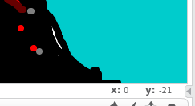

Vulkanen
========

I utmaningen vulkanen får du lära dig att göra explosiva eldsprutande berg!

Du kan titta på [Elliots!](http://scratch.mit.edu/projects/44967008/) eller [min vulkan!](http://scratch.mit.edu/projects/44225694/) för att se hur det kan se ut. 

Rita det eldsprutande berget
----------------------------

Börja med att rita en fint berg som bakgrund, du behöver inte rita någon rök, den kommer vi göra sedan

 * Klicka på [Scen, 1 bakgrund] 
 

 * Klicka sedan på bakgrund
 

Nu kan du rita ditt bakgrundsberg, min ser ut så här:

Rita rök
--------

 * Nu kan du radera katten, högerklicka och välj radera.
 * Istället för en katt lägger vi till en ny sprite som du ritar själv. Rita ett litet moln av rök och aska
 * Flytta röken så att den är ovanför vulkanens öppning.
 
Få rök att välla ut ur vulkanen
------------------------------

 * Gå in på Script
 * Lägg ut en "när [grön flagga] klickas på 
 * Lägg ut en göm
 * klicka på den gröna flaggan, vad händer?
 
Nu vill vi att flera rökmoln ska skapas, vi vill ha något som kallas för "kloner"

 * Under "göm" sätt en "skapa klon av mig själv"

Om man klickar på gröna flaggan så händer inget, varför? Jo vi har gömt vår rök!

Nu ska vi visa röken och få den att röra sig

 * Sätt ut en "När jag startar som klon"
 * Under den sätt ut en "visa"
 * klicka på grön knapp nu och se vad som händer.
 
Rökmolnet som du ser nu är din klon!

Klon-röken ska röra på sig
-------------------------------------

 *  Under "visa" sätt en "för alltid"
 *  i för alltid sätt en "gå [10] steg"
 *  klicka på grön flagga, vad händer?
 *  Nu vill jag att du får den att åka uppåt istället, hur gör man det?
 *  Innan för alltid sätt en "peka i [0] riktning"

Har du lite otur nu så åker din sprite uppåt men startar från fel ställe!

 * Sätt ut en "gå till x: [] y:[]" där du anger x och y för vulkanens mynning. Du kan hålla musen över vulkanen och se i kanten vad x och y skall vara. Min var x: 0 och y: -21
 * Testa att klicka på den gröna knappen, om molnet inte kommer rätt kan du ändra x och y så att det blir rätt...
 

Mer rök!
--------
Nu ska vi se till att det kommer mer rök från vår vulkan.

 * Du kan sätta en "för alltid" runt skapa klon av mig själv, 
 * för att det ska komma lite mindre rök, sätt en "vänta [1] sekunder"
 * Minska till 0.1 sekunder eller vad som passar bra för din vulkan!
 
Nu borde det spruta ut rök ur vulkanen! 

Väntar du en stund kommer röken ta slut. Det är för att vi skapat för många kloner! Vi måste ta bort kloner som inte längre behövs!

 * Lägg till en "om [] då" efter "gå [10] steg" innuti "för alltid"
 * Lägg till en "rör [kant]" i "om [] då"
 * Lägg till en "radera klonen" i "om [rör [kant]] då"
 

 
 Bravo!

Nu kan du själv snygga till din vulkan genom att till exempel:

 * Göra röken lite genomskinlig
 * Lägga till stenar som flyger ut
 * Få röken att åka åẗ olika håll (Titta på [Elliots!](http://scratch.mit.edu/projects/44967008/#editor))
 * Lägga till lava som flyter nerför berget.
 * Lägga till ljudeffekter! 

 
 
